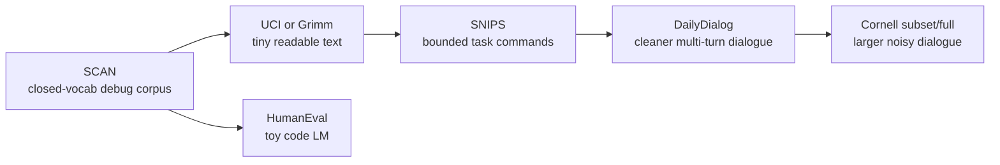

# Small Self-Contained Text Datasets for Toy Language Models

## Executive Summary

For a first neural language model built from scratch in Google Colab or on a 2020-era HP Omen 17, the best datasets are not the usual broad benchmarks like WikiText or Penn Treebank. The most practical toy corpora are the ones with narrow semantics, short files, obvious failure modes, and small enough size that you can retrain many times in an evening. The strongest “debug-first” choice is **SCAN** because it has a tiny closed vocabulary and a fully compositional command grammar. The strongest “small but actually readable English” choice is **Grimms’ Fairy Tales**. The strongest “bounded real-world commands” choice is **SNIPS**. For code-specific experiments, **HumanEval** is useful, but it is so small that it is better for sanity checks than for serious language-model claims. **DailyDialog** is the best next step when you want a cleaner, slightly larger dialogue corpus, while **Cornell Movie-Dialogs** is a good stretch corpus if you are willing to handle noisier language and less-clear licensing. citeturn37view0turn43view0turn32search0turn34search0turn35view0turn11view0turn12view0turn1search13turn29view0turn4search0turn41view0

A practical recommendation set is therefore: **fastest experimentation**: SCAN, Grimm, and UCI Sentiment Labelled Sentences; **slightly larger but still very manageable**: SNIPS and DailyDialog. If you specifically want dialogue at larger scale, use a **Cornell subset first**, not the full corpus. If you specifically want code, replace UCI or Grimm with **HumanEval**. citeturn37view0turn32search0turn34search0turn11view0turn4search0turn41view0turn1search13

## Selection Criteria and Hardware Assumptions

I prioritized datasets that are semantically bounded, English-language, easy to download, and small enough to train on commodity hardware. In practice that means short commands, short dialogues, fairy tales, review sentences, or tiny code prompts. I also favored primary or near-primary sources such as the original repository, UCI, Project Gutenberg, ACL Anthology, OpenAI’s repository, and Cornell’s ConvoKit documentation. citeturn37view0turn32search0turn34search0turn4search2turn41view0turn1search13

Training-time estimates below assume a small PyTorch model trained in FP32, with no fancy distributed setup, and they are **my engineering estimates**, not source-reported benchmarks. For Colab, Google documents that free access can include GPUs and TPUs, but resource availability is not guaranteed and usage limits still apply; the estimates therefore assume you actually receive a free GPU. For the laptop, I use a representative 2020 HP Omen 17 hardware class: review/spec pages for Omen 17-cb systems show Intel Core i7-10750H CPUs with RTX 2060 or RTX 2070 laptop GPUs in common configurations, so I report both CPU-only and optional local-GPU ranges, while noting that your exact discrete GPU is unspecified. citeturn22search0turn22search12turn21search0turn21search2turn21search6

Token and vocabulary counts marked with `~` are rough preprocessing-dependent estimates. They change materially depending on whether you lowercase, strip punctuation, keep metadata, perform BPE, or train on characters rather than words.



## Prioritized Candidate Datasets

| Priority | Dataset | Source URL | Size | Typical vocab | Semantic domain | License | Download method | Sample lines |
|---|---|---|---|---|---|---|---|---|
| High | **SCAN** citeturn37view0turn43view0turn7view0 | `https://github.com/brendenlake/SCAN` | 20,910 command-action pairs; `tasks.txt` is 3.89 MB; ~152k command tokens or ~493k full-line tokens* | 13 command tokens, or 21 if you keep `IN:/OUT:` and action-side tokens* | Synthetic navigation commands | BSD | `git clone` repo or fetch `tasks.txt`; standard splits included | `IN: jump thrice` → `OUT: JUMP JUMP JUMP` |
| High | **Grimms’ Fairy Tales** citeturn34search0turn35view0 | `https://www.gutenberg.org/ebooks/2591.txt.utf-8` | Plain-text UTF-8 is 547 kB; ~101k word tokens and ~7,916 non-empty lines after stripping boilerplate* | ~4.8k word types* | Public-domain fairy tales | Project Gutenberg terms; public-domain text in the U.S. | `wget https://www.gutenberg.org/ebooks/2591.txt.utf-8` | `A certain king had a beautiful garden...` |
| High | **UCI Sentiment Labelled Sentences** citeturn32search0 | `https://archive.ics.uci.edu/dataset/331/sentiment+labelled+sentences` | 3,000 sentences total; files are 56.9 kB, 59.9 kB, and 83.3 kB; zip download 82.2 kB | ~4k–6k word types* | Very short product, movie, and restaurant reviews | CC BY 4.0 | Browser download or `from ucimlrepo import fetch_ucirepo; fetch_ucirepo(id=331)` | Format is `sentence<TAB>score` where score is `1` or `0` |
| Medium | **SNIPS NLU benchmark** citeturn11view0turn12view0 | `https://github.com/sonos/nlu-benchmark` | 7 intents; more than 2,000 queries per intent, so `>14k` utterances total | ~5k–10k word/piece types* | Voice-assistant commands across 7 domains | CC0-1.0 | `git clone`; use `2017-06-custom-intent-engines/*/train_*_full.json` | `Play the last track from Beyoncé off Spotify` |
| Medium | **DailyDialog** citeturn4search2turn6search2turn42search3 | `https://huggingface.co/datasets/roskoN/dailydialog` | 13,118 dialogues; total file size 2.3 MB | ~15k–25k word types* or 2k–8k BPE | Human-written daily-life two-speaker dialogue | CC BY-NC-SA 4.0 | `datasets.load_dataset("roskoN/dailydialog")` | `"What sports do you like to play ?"` / `"I like baseball and basketball ."` |
| Medium | **HumanEval** citeturn1search13turn29view0turn36search14 | `https://github.com/openai/human-eval` | 164 hand-written Python problems; `HumanEval.jsonl.gz` is 43.8 kB | ~3k–8k subwords* or ~100–200 characters for char-level | Tiny Python programming prompts and tests | MIT | `git clone` and read `data/HumanEval.jsonl.gz` | `def has_close_elements(numbers, threshold):` |
| Lower | **Cornell Movie-Dialogs Corpus** citeturn41view0turn17search4 | `https://convokit.cornell.edu/documentation/movie.html` | 304,713 utterances; 83,097 conversations; 220,579 conversational exchanges; 617 movies | ~20k–50k word types* or 4k–16k BPE | Fictional movie dialogue | Treat as a research corpus; the cited pages do not expose a clear short-form OSI/CC license on-page | `from convokit import Corpus, download; Corpus(filename=download("movie-corpus"))` | `movie_lines.txt: lineID +++$+++ characterID +++$+++ movieID +++$+++ character +++$+++ text` |

A few analytical takeaways matter more than the raw table. **SCAN** is the most controlled corpus here; most bugs become obvious immediately because the grammar is tiny and the vocabulary is closed. **Grimm** is the smallest corpus that still feels like “real text generation” rather than a tokenizer or loop test. **SNIPS** is excellent when you want bounded semantics but more lexical variety than SCAN. **DailyDialog** is the cleanest entry point to multi-turn dialogue. **Cornell** is useful, but it is the least semantically self-contained of the shortlist and it is noticeably noisier. **HumanEval** is a toy code corpus, not a genuine code-pretraining substitute. citeturn37view0turn34search0turn11view0turn4search2turn41view0turn1search13

## Training Feasibility and Recommended Configurations

The table below gives **practical starting points**, not universal optima. I mostly recommend GRUs for these scales because they are easier to implement from scratch, are friendlier on CPU, and are usually enough for toy experiments. A tiny decoder-only Transformer is also viable on Colab for Grimm, SNIPS, DailyDialog, and Cornell subsets, but it is usually about **1.5× to 2.5× slower** and needs more VRAM than the comparable GRU setup.

| Dataset | Recommended tokenization | Recommended model | Batch × seq | Epochs | Colab free GPU | Omen CPU-only | Omen with local GTX/RTX | Peak VRAM / RAM | Disk |
|---|---|---|---|---:|---:|---:|---:|---|---|
| SCAN | Word-level, command side only | 1–2 layer GRU, emb/hidden 128, ~0.3–0.8M params | 128 × 32 | 30–80 | 0.05–0.2 h | 0.3–1.0 h | `<0.2 h` | 0.3–0.8 GB / 1–2 GB | 5–20 MB |
| UCI Sentiment | Word-level lowercase | 1-layer GRU 128, ~0.3–0.8M params | 64 × 24 | 50–150 | `<0.1 h` | 0.1–0.5 h | `<0.1 h` | 0.2–0.6 GB / 1–2 GB | `<10 MB` |
| HumanEval | Char-level or byte/BPE-512 | 2-layer GRU 256, ~0.8–1.5M params | 64 × 128 | 30–80 | 0.1–0.4 h | 0.5–2 h | 0.2–0.8 h | 0.5–1.5 GB / 2–4 GB | 10–50 MB |
| Grimm | Char-level or BPE-2k | 2-layer GRU 256–384, ~1–3M params | 64 × 128 chars or 64 × 64 subwords | 15–40 | 0.2–0.8 h | 1–4 h | 0.3–1.5 h | 0.8–2 GB / 2–4 GB | 20–80 MB |
| SNIPS | Word-level or BPE-1k | 2-layer GRU 256, ~1–3M params | 64 × 32 | 10–30 | 0.2–0.7 h | 1–3 h | 0.3–1 h | 0.8–2 GB / 2–4 GB | 30–100 MB |
| DailyDialog | BPE-2k to 4k with `<turn>` markers | 2-layer GRU 256 or 4-block Transformer d=256, ~2–5M params | 64 × 64 (GRU) or 32 × 128 (Transformer) | 5–15 | 0.5–2 h | 3–10 h | 1–4 h | 2–5 GB / 4–8 GB | 100–300 MB |
| Cornell | BPE-4k to 8k; start with subset | 2-layer GRU 256–384 or 4-block Transformer d=256, ~3–5M params | 64 × 64 or 32 × 128 | 2–6 full, 5–10 subset | 1–4 h full | 6–20 h full | 2–8 h full | 3–6 GB / 8–16 GB | 0.5–1.5 GB incl. caches and checkpoints |

These estimates assume Colab free actually gives you a GPU and does not disconnect mid-run; Google explicitly notes that free compute access exists but is limited and not guaranteed. The laptop estimates assume a representative Omen 17 class device around the i7-10750H generation, with optional RTX 2060/2070-class local GPU if present. citeturn22search0turn22search12turn21search0turn21search2turn21search6

In practical terms, this means:

- If your main goal is **implementation debugging**, use **SCAN** or **UCI**.
- If your main goal is **getting intelligible generations very quickly**, use **Grimm**.
- If your main goal is **bounded command language** rather than stories, use **SNIPS**.
- If your main goal is **dialogue**, use **DailyDialog** first and **Cornell subset** second.
- If your main goal is **toy code generation**, use **HumanEval**, but treat it strictly as a debug corpus, not as a benchmark for general code modeling. citeturn37view0turn32search0turn34search0turn11view0turn4search2turn41view0turn1search13

## Best Picks for Fast and Medium Experiments

For **fastest experimentation**, my strongest recommendations are:

**SCAN** is the best first corpus if your priority is building the full training pipeline correctly. You can see immediately whether your vocabulary, batching, teacher forcing, sampling, and checkpointing work, because the command patterns are extremely regular and the vocabulary is tiny. It also trains in minutes, so you can afford many restarts. citeturn37view0turn43view0turn7view0

**Grimms’ Fairy Tales** is the best small corpus for the “first fun result.” It is still tiny by LM standards, but large enough that a 1–3M parameter GRU can learn style, punctuation, capitalization, and some narrative rhythm. It is also public-domain text and very easy to fetch and preprocess. citeturn34search0turn35view0

**UCI Sentiment Labelled Sentences** is the fastest real-English sentence corpus when you just want to verify that your model can overfit short natural-language sequences. It is too small for broad language modeling, but precisely because of that, it is excellent for sanity checks, ablation tests, and comparing tokenization schemes. citeturn32search0

If your interest is code rather than natural language, swap UCI for **HumanEval**. It is tiny, clean, and code-shaped, but so small that it should be treated as a toy exercise or a code-tokenizer/debug corpus rather than as meaningful code-model training. citeturn1search13turn29view0turn36search14

For **slightly larger experiments**, the best two are:

**SNIPS** is the best bounded-semantics command dataset after SCAN. It has substantially more lexical variety than SCAN, but it still stays inside a compact assistant-command universe. That makes it ideal for experimenting with word-level models, subword tokenization, and turn separators while keeping training times short. citeturn11view0turn12view0

**DailyDialog** is the best next step if you want multi-turn generation with cleaner language than movie subtitles. It is noticeably larger than Grimm or SNIPS, but still light enough for a small 2–5M parameter model in Colab or on a gaming laptop. It also tends to produce more stable early conversational samples than noisier subtitle corpora. citeturn4search2turn6search2turn42search3

A good stretch option is **Cornell Movie-Dialogs**, but my advice is to start with **50k–100k utterances**, not the full corpus. That gives you the dialogue flavor and vocabulary diversity without forcing long CPU-only runs or larger memory usage before you know your training code is sound. citeturn41view0turn17search4

## Minimal Preprocessing and PyTorch Training Sketch

Across these datasets, the preprocessing recipe should stay simple. Strip obvious boilerplate, preserve case only when it matters, insert an explicit end-of-sequence token, split by higher-level unit to avoid leakage, and keep tokenizer complexity proportional to dataset size. For SCAN, you usually want the **command side only** if you are building a language model rather than a seq2seq system. For SNIPS, concatenate the `text` segments and discard entity tags if the task is pure next-token prediction. For DailyDialog or Cornell, join turns with a `<turn>` token and conversations with `<eos>`. For Grimm, strip Gutenberg headers and footers. For HumanEval, **do not lowercase** and **do not destroy indentation**. citeturn37view0turn12view0turn35view0turn42search3turn41view0turn1search13

A compact preprocessing flow looks like this:

- Decide **character-level** for the absolute simplest implementation, or **word/BPE-level** for more interpretable tokens.
- Split by **story**, **dialogue**, **conversation**, or **function prompt**, not by arbitrary windows first.
- Add `<eos>` after each training unit.
- Build the vocabulary on train only.
- Encode to integer IDs.
- Train on fixed windows cut from the encoded stream.

Here is a short PyTorch sketch for a **word-level GRU language model** that is easy to adapt. For char-level, replace `tokenize` with `list(text)`.

```python
import math, random, re
from collections import Counter
from pathlib import Path

import torch
import torch.nn as nn
from torch.utils.data import Dataset, DataLoader

device = "cuda" if torch.cuda.is_available() else "cpu"

# ---------- Load your corpus as a list of strings ----------
# Example:
# texts = Path("grimm.txt").read_text(encoding="utf-8").splitlines()
# texts = [t.strip() for t in texts if t.strip()]
texts = [
    "once upon a time there was a king",
    "the king had a beautiful garden",
    "every night one golden apple was gone",
]

# ---------- Minimal normalization ----------
def normalize(s: str) -> str:
    s = s.replace("’", "'").replace("“", '"').replace("”", '"')
    s = re.sub(r"\s+", " ", s.strip())
    return s.lower()  # keep case for code datasets

def tokenize(s: str):
    return re.findall(r"[a-z]+(?:'[a-z]+)?|[.,!?;:]", s)

texts = [normalize(t) for t in texts if t.strip()]
random.seed(42)
random.shuffle(texts)

n = len(texts)
train_texts = texts[: max(1, int(0.9 * n))]
val_texts   = texts[max(1, int(0.9 * n)) :]

# ---------- Build vocab ----------
SPECIAL = ["<pad>", "<unk>", "<eos>"]
counter = Counter()
for t in train_texts:
    counter.update(tokenize(t))

itos = SPECIAL + [w for w, c in counter.items() if c >= 1]
stoi = {w: i for i, w in enumerate(itos)}
PAD, UNK, EOS = stoi["<pad>"], stoi["<unk>"], stoi["<eos>"]

def encode_texts(texts_):
    ids = []
    for t in texts_:
        ids.extend(stoi.get(tok, UNK) for tok in tokenize(t))
        ids.append(EOS)
    return torch.tensor(ids, dtype=torch.long)

train_ids = encode_texts(train_texts)
val_ids   = encode_texts(val_texts if val_texts else train_texts[:1])

# ---------- Sliding-window dataset ----------
class WindowDataset(Dataset):
    def __init__(self, ids, seq_len=32):
        self.ids = ids
        self.seq_len = seq_len

    def __len__(self):
        return max(1, len(self.ids) - self.seq_len - 1)

    def __getitem__(self, idx):
        x = self.ids[idx : idx + self.seq_len]
        y = self.ids[idx + 1 : idx + self.seq_len + 1]
        return x, y

seq_len = 32
batch_size = 64

train_ds = WindowDataset(train_ids, seq_len)
val_ds   = WindowDataset(val_ids, seq_len)

train_dl = DataLoader(train_ds, batch_size=batch_size, shuffle=True, drop_last=False)
val_dl   = DataLoader(val_ds, batch_size=batch_size, shuffle=False, drop_last=False)

# ---------- Model ----------
class GRULM(nn.Module):
    def __init__(self, vocab_size, d_model=128, hidden=128, layers=1):
        super().__init__()
        self.emb = nn.Embedding(vocab_size, d_model, padding_idx=PAD)
        self.rnn = nn.GRU(d_model, hidden, num_layers=layers, batch_first=True)
        self.lm_head = nn.Linear(hidden, vocab_size)

    def forward(self, x, h=None):
        x = self.emb(x)
        out, h = self.rnn(x, h)
        logits = self.lm_head(out)
        return logits, h

model = GRULM(len(itos), d_model=128, hidden=128, layers=1).to(device)
opt = torch.optim.AdamW(model.parameters(), lr=3e-3)
criterion = nn.CrossEntropyLoss(ignore_index=PAD)

# ---------- Train / eval ----------
def run_epoch(loader, train=True):
    model.train(train)
    total_loss, total_tokens = 0.0, 0
    torch.set_grad_enabled(train)
    for x, y in loader:
        x, y = x.to(device), y.to(device)
        logits, _ = model(x)
        loss = criterion(logits.reshape(-1, logits.size(-1)), y.reshape(-1))
        if train:
            opt.zero_grad(set_to_none=True)
            loss.backward()
            torch.nn.utils.clip_grad_norm_(model.parameters(), 1.0)
            opt.step()
        n_tokens = (y != PAD).sum().item()
        total_loss += loss.item() * n_tokens
        total_tokens += n_tokens
    ppl = math.exp(total_loss / max(1, total_tokens))
    return ppl

for epoch in range(10):
    train_ppl = run_epoch(train_dl, train=True)
    val_ppl   = run_epoch(val_dl, train=False)
    print(f"epoch={epoch+1} train_ppl={train_ppl:.2f} val_ppl={val_ppl:.2f}")

# ---------- Sampling ----------
@torch.no_grad()
def sample(prompt="once upon a time", max_new=20):
    model.eval()
    toks = [stoi.get(tok, UNK) for tok in tokenize(normalize(prompt))]
    x = torch.tensor([toks], dtype=torch.long, device=device)
    h = None
    for _ in range(max_new):
        logits, h = model(x[:, -seq_len:], h)
        next_id = torch.distributions.Categorical(logits=logits[0, -1].softmax(-1)).sample().item()
        toks.append(next_id)
        if next_id == EOS:
            break
        x = torch.tensor([toks], dtype=torch.long, device=device)
    return " ".join(itos[i] for i in toks if i not in {EOS, PAD})

print(sample())
```

Minimal hyperparameter defaults that work well as starting points are:

- **SCAN / UCI**: GRU-128, batch 64–128, seq 24–32, lr `2e-3` to `3e-3`, epochs 30–100.
- **Grimm / SNIPS / HumanEval**: GRU-256, batch 64, seq 64–128, lr `1e-3` to `3e-3`, epochs 10–40.
- **DailyDialog / Cornell subset**: GRU-256 or tiny Transformer, batch 32–64, seq 64–128, lr `1e-3`, epochs 5–15.

## Limitations and Evaluation

The central limitation of these corpora is that **small does not mean representative**. SCAN is wonderfully useful for debugging, but it is synthetic. UCI sentiment sentences are real English, but only 3,000 lines. HumanEval is a benchmark set, not a corpus for meaningful code pretraining. DailyDialog is noncommercial. Cornell is useful, but the cited documentation does not surface a clean short-form license on-page, so you should verify usage conditions before publishing or redistributing derivatives. Project Gutenberg availability is straightforward in the U.S., but legal reuse depends on jurisdiction. citeturn37view0turn32search0turn1search13turn6search2turn41view0turn34search1

A second limitation is **leakage and overfitting**. On tiny corpora, you can get excellent perplexity while merely memorizing. The most common mistake is splitting after tokenization rather than by document unit. For Grimm, split by story if you can. For DailyDialog and Cornell, split by conversation. For HumanEval, if you care about evaluation at all, do not train and test on the same problems. This matters much more than squeezing an extra half-point of perplexity out of the optimizer.

For evaluation, use a small bundle of metrics rather than one number. **Validation perplexity** is the main scalar metric for any next-token LM. For character models, also report **bits-per-character**. For generation quality, keep a fixed set of prompts and sample at temperatures like `0.8`, `1.0`, and `1.2`. For command or formal datasets, add a **validity metric**: does the SCAN sample stay in the grammar, does the SNIPS command look structurally plausible, does HumanEval output parse as Python, and can it pass any held-out tests. For dialogue datasets, track **repetition**, **turn-boundary handling**, and a simple diversity statistic like **distinct-1/2** alongside perplexity.

### Open questions and limitations

Some dataset statistics above are intentionally approximate because exact token counts depend on preprocessing choices, and a few official sources publish instance counts and file sizes but not canonical LM token/vocabulary counts. Cornell licensing is also less explicit on the cited pages than DailyDialog, UCI, SCAN, SNIPS, Project Gutenberg, or HumanEval. Those ambiguities do not block experimentation, but they do matter if you want to compare numbers rigorously or redistribute trained artifacts.