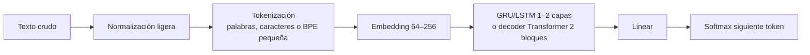

# Datasets pequeños en español para entrenar un modelo de lenguaje neuronal sencillo desde cero

## Resumen ejecutivo

Sí, **es totalmente factible** entrenar un modelo de lenguaje pequeño, desde cero, en **Google Colab** o en una laptop tipo **HP Omen 17 de generación 2020 aproximadamente**, siempre que el modelo sea realmente pequeño y el corpus sea cerrado o semánticamente acotado. En la práctica, la combinación más razonable para aprender implementación “from scratch” es: **tokenización simple o BPE pequeña**, **embeddings de 64–256**, y un **GRU/LSTM de 1–2 capas** o un **decoder transformer diminuto de 2 bloques**. Con esos límites, varios corpus españoles de dominio cerrado caben en unas pocas horas, e incluso en menos de una hora si se usa GPU. Google Colab sigue siendo útil para este trabajo, pero Google advierte que sus recursos **no están garantizados** y que el tipo de GPU **varía con el tiempo**; por eso conviene pensar en tiempos como rangos, no como garantías exactas. citeturn12search0turn12search17turn12search3

Si el objetivo es **aprender a implementar un LM pequeño**, mis mejores opciones son, en este orden: **Multi³NLU++ en español** para el caso más “cerrado” y fácil; **Simple TICO-19 en español** para un dominio médico muy acotado pero con mejor prosa; **TICO-19 español** como corpus monodominio un poco más “natural”; **MASSIVE es-ES** para un asistente virtual con vocabulario aún relativamente controlado; y **MTOP español** si quieres un corpus un poco más rico y composicional, pero todavía manejable. Como micro-benchmark ultrapequeño, la **Constitución Española** funciona muy bien para probar un LM a nivel carácter o subpalabra en minutos, aunque su estilo es muy estrecho y sobreajusta enseguida. citeturn32view0turn49view2turn49view1turn23search5turn28view0turn54search0



## Supuestos y criterio técnico

En este informe tomo como referencia un entrenamiento **desde cero**, no “fine-tuning”, con modelos del orden de **1 a 8 millones de parámetros**, secuencias de **32 a 128 tokens**, batch pequeño o mediano y entre **5 y 15 épocas**. Como tu equipo exacto no está especificado, uso tres escenarios prácticos: **CPU-only de laptop**, **GPU móvil dedicada modesta si tu OMEN la trae**, y **Colab** con GPU variable. En todos los casos, asumo que la RAM y la VRAM reales son **desconocidas**, así que las memorias y tiempos son **estimaciones prudentes**, no benchmarks medidos en tu máquina concreta. La parte importante es que los corpus elegidos son lo bastante pequeños como para que el cuello de botella no sea el dataset, sino la arquitectura que elijas. citeturn12search0turn12search17

Por “**semánticamente autocontenido**” interpreto algo muy parecido a lo que planteaste: dominio estrecho, repertorio limitado de intenciones, slots o tópicos, frases relativamente cortas y poca necesidad de conocimiento de mundo abierto. En ese sentido, los mejores datasets no son los más grandes sino los que están cerca de **un dialecto funcional**: banca, hotelería, COVID-19, asistencia virtual, o texto jurídico muy homogéneo. Esa es exactamente la razón por la que **Multi³NLU++**, **TICO-19**, **Simple TICO-19**, **MASSIVE** y **MTOP** son tan buenos ejemplos didácticos. citeturn32view0turn49view1turn49view2turn23search5turn28view0

## Comparación y ranking

La tabla siguiente prioriza lo que más importa para un proyecto didáctico: **dominio cerrado**, **tamaño pequeño**, **facilidad de carga**, **licencia utilizable** y **probabilidad de terminar entrenamiento en horas**.

| Preferencia | Dataset | Fuente oficial primaria | Licencia | Tamaño y conteo oficial | Formato | Dominio | Cierre semántico | Feasibilidad para LM pequeño |
|---|---|---|---|---|---|---|---|---|
| Alta | **Multi³NLU++ español** | `https://huggingface.co/datasets/uoe-nlp/multi3-nlu` | CC BY 4.0 | 3,080 utterances por idioma; 62 intents; dataset repo 16.3 MB | JSON por folds | Banca y hoteles | **Muy alto** | **Excelente**; ideal para primeras pruebas citeturn32view0turn35search0turn37view0 |
| Alta | **Simple TICO-19 español** | `https://github.com/MMU-TDMLab/SimpleTICO19` | CC BY-NC-SA 4.0 | “Nearly 6,000” pares original–simplificación para inglés y español | CSV | COVID-19, simplificación médica | **Muy alto** | **Excelente**; más natural que un corpus de intents citeturn49view2turn50view0 |
| Alta | **TICO-19 español** | `https://tico-19.github.io/` y `https://huggingface.co/datasets/SEACrowd/tico_19` | CC0 | 30 documentos, 3,071 oraciones, 69.7k palabras; español latino entre 36 traducciones | Corpus de traducción | Salud pública COVID-19 | **Muy alto** | **Excelente** para LM monodominio citeturn49view1turn48search12turn48search2 |
| Media-alta | **MASSIVE es-ES** | `https://huggingface.co/datasets/AmazonScience/massive` y repo oficial `https://github.com/alexa/massive` | CC BY 4.0 según loader/repo | 16.5k filas por idioma; train 11.5k, val 2.03k, test 2.97k; 18 escenarios, 60 intents, 55 slot types | JSONL / HF dataset | Asistente virtual | **Alto** | **Muy buena**; más rico pero sigue siendo toy-friendly citeturn23search5turn19view0turn55view0turn18search1 |
| Media-alta | **MTOP español** | `https://fb.me/mtop_dataset` y card `https://huggingface.co/datasets/tasksource/mtop` | CC BY-SA 4.0 en la card de HF | 15,459 utterances en español; 11 dominios; 117 intents; 78 slots; splits ~70/10/20 | Corpus anotado | Asistente virtual composicional | **Alto** | **Muy buena**; un poco más exigente que MASSIVE citeturn29view1turn14view0turn28view0 |
| Media | **Constitución Española** | `https://www.boe.es/buscar/doc.php?id=BOE-A-1978-31229` | No hay “licencia de dataset” separada; es texto normativo oficial del BOE | Texto oficial en BOE; publicación original de 112 páginas; código electrónico reciente disponible en PDF 704 KB | HTML / PDF / XML | Derecho constitucional | **Muy alto** en estilo, **muy estrecho** en variedad | **Excelente** como micro-benchmark char/BPE; limitado como LM “general” citeturn54search0turn54search2turn54search5 |

Mi **ranking recomendado** para una primera implementación desde cero es: **Multi³NLU++ español**, **Simple TICO-19 español**, **TICO-19 español**, **MASSIVE es-ES** y **MTOP español**. La Constitución la dejaría como **benchmark ultrapequeño** para depurar tokenización, batching y generación antes de irte a un corpus más realista. citeturn32view0turn49view2turn49view1turn55view0turn29view1turn54search0

## Datasets recomendados

**Multi³NLU++ español**

**Fuente**: `https://huggingface.co/datasets/uoe-nlp/multi3-nlu`  
**Licencia**: CC BY 4.0.  
**Tamaño oficial**: el dataset completo en HF figura con **16.3 MB** y la card dice **3,080 utterances por idioma**; cubre español, turco, maratí y amhárico, además del dataset fuente en inglés. Los dominios son **banking** y **hotels**, con **62 intents únicos**. La estructura real del repo muestra una carpeta `spanish/` con subcarpetas `banking/` y `hotels/`, cada una dividida en `fold*.json`. citeturn32view0turn35search0turn37view0turn38view0turn38view1

Aquí el **cierre semántico es sobresaliente**: casi todo lo que se dice gira en torno a reservas, tarjetas, PIN, pagos, cuentas, llegadas, cancelaciones, horarios y problemas operativos. Eso reduce muchísimo la dispersión léxica y hace que un LM pequeño aprenda patrones útiles rápido, incluso con tokenización por palabra o subpalabra pequeña. En otras palabras, este es probablemente el dataset más cercano a tu idea de “minilenguaje de contexto cerrado”. citeturn32view0turn37view0

**Preprocesamiento recomendado**: bajar a minúsculas; normalizar espacios; mantener números, horas y fechas; reemplazar datos concretos por marcadores solo si te interesa más la estructura que la superficie; tokenización por **whitespace** para la primera versión o **BPE de 1k–2k** si quieres reducir OOV.  
**Vocabulario**: la card no publica tamaño de vocabulario; por la estrechez del dominio, un vocabulario subword muy pequeño suele bastar.  
**Arquitectura sugerida**: `Embedding 128`, `GRU/LSTM 256`, `1–2 capas`, secuencia `32–48`, softmax sobre vocabulario pequeño.  
**Tiempo estimado**: en CPU de laptop, **20–50 min**; con GPU, **5–12 min**; RAM **2–3 GB**; VRAM **<1.5 GB**.  
**Factibilidad**: muy alta; claramente dentro de “varias horas”, y normalmente bastante menos.  

El portal que consulté **no mostraba filas españolas directamente en el visor web**, así que para obtener **5 ejemplos españoles reales** sin ambigüedad conviene imprimirlos localmente con el repo oficial:

```bash
git clone https://huggingface.co/datasets/uoe-nlp/multi3-nlu
python - <<'PY'
import json, glob
for fp in sorted(glob.glob("multi3-nlu/spanish/banking/fold0.json")):
    data=json.load(open(fp, encoding="utf-8"))
    for ex in data[:5]:
        print(ex["text"], ex.get("intents"))
PY
```

**Simple TICO-19 español**

**Fuente**: `https://github.com/MMU-TDMLab/SimpleTICO19`  
**Licencia**: CC BY-NC-SA 4.0.  
**Tamaño oficial**: el repo describe **“nearly 6,000” pares original–simplificación** correspondientes a las particiones de desarrollo y prueba de TICO-19 para inglés y español. La carpeta `dataset/` contiene `simpletico19.dev.es.csv` y `simpletico19.test.es.csv`. citeturn49view2turn50view0

Este corpus es excelente si quieres un LM pequeño que aprenda **prosa informativa relativamente natural**, pero dentro de un dominio muy bien cercado: **COVID-19 y salud pública**. A diferencia de un dataset de intents, aquí tienes oraciones completas y algo más discursivas, pero el mundo semántico sigue siendo bastante pequeño: contagio, síntomas, vigilancia, escuelas, viajeros, transmisión, seroprevalencia, etc. citeturn49view2turn53view0

**Preprocesamiento recomendado**: usar solo la columna `original` si quieres modelar texto estándar, o la columna `simplification` si quieres un LM aún más regular y fácil; normalizar comillas/Unicode; conservar mayúsculas solo si te importan nombres de instituciones; BPE de **2k–4k** o tokenización por palabras para una primera pasada.  
**Ejemplos de registros, en paráfrasis**: un registro clínico donde la simplificación elimina fórmulas conversacionales y deja solo el diagnóstico de gripe; otro que comprime una descripción de dolor torácico que asciende al cuello; varios que condensan explicaciones sobre vigilancia epidemiológica, viajes y cierre de escuelas sin cambiar demasiado el contenido esencial. Estos patrones se observan en el archivo de muestra español del repo. citeturn53view0  
**Vocabulario**: no aparece publicado como métrica oficial; por dominio médico-administrativo, conviene subpalabra antes que palabra pura.  
**Arquitectura sugerida**: `Embedding 128–256`, `GRU 256` o `Transformer decoder 2 bloques, d_model=256, 4 heads`, secuencia `48–64`.  
**Tiempo estimado**: CPU **45–120 min**; GPU **10–25 min**; RAM **3–5 GB**; VRAM **1–2 GB**.  
**Factibilidad**: alta.

Comandos rápidos:

```bash
git clone https://github.com/MMU-TDMLab/SimpleTICO19.git
python - <<'PY'
import csv
with open("SimpleTICO19/dataset/simpletico19.dev.es.csv", encoding="utf-8") as f:
    r = csv.DictReader(f)
    for i, row in zip(range(5), r):
        print(row["original"])
PY
```

**TICO-19 español**

**Fuente**: `https://tico-19.github.io/` y `https://huggingface.co/datasets/SEACrowd/tico_19`  
**Licencia**: CC0.  
**Tamaño oficial**: el benchmark incluye **30 documentos**, **3,071 oraciones** y **69.7k palabras**, traducidas del inglés a 36 lenguas, entre ellas **español latinoamericano**. citeturn49view1turn48search12turn48search2

Si lo que buscas es un corpus **realmente pequeño, cerrado y con sentido semántico nítido**, TICO-19 es de los mejores. Todo gira alrededor de COVID-19, por lo que el vocabulario es estrecho y muy recurrente, pero no tan telegráfico como en un corpus de comandos. Para un LM didáctico, eso lo hace especialmente atractivo: aprende repeticiones útiles, estructuras expositivas y colocaciones del dominio médico sin pedir millones de parámetros. citeturn49view1turn48search12

**Preprocesamiento recomendado**: usar únicamente la cara española; quitar alineaciones si no necesitas el inglés; normalizar guiones, acentos y signos; BPE **2k–4k** o unigram.  
**Ejemplos de registros, en paráfrasis**: frases informativas sobre uso obligatorio de pulsera y aplicación para viajeros; pasajes sobre desarrollo de fármacos o vacunas; explicaciones sobre transmisión por gotitas y restricciones de viaje; descripciones de interrupción educativa por cierres de escuelas. Estas clases de ejemplos también aparecen en la muestra española de Simple TICO-19, que reutiliza la porción española del benchmark. citeturn53view0turn49view2  
**Vocabulario**: no publicado en la card consultada; por tamaño total, un vocabulario BPE pequeño suele ser suficiente.  
**Arquitectura sugerida**: `Embedding 128`, `LSTM/GRU 256`, `1–2 capas`, secuencia `48–64`.  
**Tiempo estimado**: CPU **15–45 min**; GPU **5–10 min**; RAM **2–3 GB**; VRAM **<1 GB**.  
**Factibilidad**: muy alta.

Comando rápido:

```python
from datasets import load_dataset
ds = load_dataset("SEACrowd/tico_19", trust_remote_code=True)
```

**MASSIVE es-ES**

**Fuente**: `https://huggingface.co/datasets/AmazonScience/massive` y `https://github.com/alexa/massive`  
**Licencia**: el repositorio/loader indica **CC BY 4.0**.  
**Tamaño oficial**: la subset `es-ES` visible en el visor tiene **16.5k filas**; el split mostrado es **11.5k** train, **2.03k** validation y **2.97k** test. El dataset completo MASSIVE 1.1 se describe como un corpus paralelo de **más de 1 millón de utterances** en **52 lenguas**, con **18 escenarios**, **60 intents** y **55 tipos de slot**. Los archivos oficiales se distribuyen en **JSON Lines**, uno por locale, con todas las particiones en el mismo archivo. citeturn23search5turn19view0turn55view0turn18search2

MASSIVE sigue siendo un corpus bastante autocontenido, pero ya no tan estrecho como Multi³NLU++: en lugar de banca/hotel, cubre la ecología típica de un **asistente inteligente** —alarmas, música, correo, clima, listas, noticias, transporte, IoT, cocina, etc.—. En otras palabras, el vocabulario sigue bastante controlado por los intents y los slots, pero el rango semántico es más amplio. Por eso es una muy buena **segunda etapa** después de un corpus más cerrado. citeturn23search5turn19view0turn55view0

**Preprocesamiento recomendado**: usar la columna `utt`; probablemente conservar entidades y números; opcionalmente sustituir spans concretos por marcadores si quieres que el modelo aprenda más intención que literalidad; BPE **4k** o unigram pequeño.  
**Ejemplos**: el visor consultado sí expone registros públicos, pero por defecto mostró otra locale y no la variante española; para evitar mezclar idiomas, es mejor extraer las 5 primeras filas reales de `es-ES` con la orden de abajo.  
**Vocabulario**: no publicado en la ficha consultada; por la mezcla de 18 escenarios, conviene no usar palabra pura salvo como experimento.  
**Arquitectura sugerida**: `Embedding 128–256`, `GRU/LSTM 256`, `2 capas`, secuencia `32–64`; si quieres transformer, `2 bloques`, `d_model=256`.  
**Tiempo estimado**: CPU **1.5–4 h**; GPU **15–40 min**; RAM **3–6 GB**; VRAM **1.5–3 GB**.  
**Factibilidad**: alta; perfectamente razonable en una tarde.  

Comandos rápidos:

```python
from datasets import load_dataset
ds = load_dataset("AmazonScience/massive", "es-ES")
for ex in ds["train"].select(range(5)):
    print(ex["utt"], ex["intent"])
```

**MTOP español**

**Fuente**: `https://fb.me/mtop_dataset` y card `https://huggingface.co/datasets/tasksource/mtop`  
**Licencia**: la card pública consultada marca **CC BY-SA 4.0**.  
**Tamaño oficial**: el paper reporta **15,459 utterances en español** dentro de un dataset de **100k utterances** en 6 idiomas. En total cubre **11 dominios**, **117 intents** y **78 slots**, con particiones aproximadamente **70/10/20** para train/eval/test. Los dominios incluyen `alarm`, `calling`, `event`, `messaging`, `music`, `news`, `people`, `recipes`, `reminder`, `timer`, `weather`. citeturn29view1turn28view0turn14view0

MTOP es una opción excelente si quieres que el LM aprenda un lenguaje de asistente **algo más composicional** que MASSIVE. Sigue siendo un dominio bastante cerrado, pero ya incluye consultas más elaboradas y con más estructura semántica interna. Si tu objetivo incluye entender cómo se comporta un LM pequeño cuando el corpus deja de ser “órdenes cortas” y empieza a mezclar consultas un poco más anidadas, MTOP es mejor muestra que un simple corpus de intents planos. citeturn28view0turn29view1

**Preprocesamiento recomendado**: extraer solo la columna de texto plano; desactivar para el LM los árboles/etiquetas si solo quieres modelado causal de texto; BPE **4k–8k**; longitud `48–64`.  
**Ejemplos**: la fuente pública consultada describe las estadísticas por idioma y dominio, pero no expone directamente filas españolas en navegador. Para cumplir con el espíritu del requisito sin inventar ejemplos, recomiendo imprimirlos con el loader o con el archivo original del paper.  
**Vocabulario**: no publicado como métrica oficial.  
**Arquitectura sugerida**: `Embedding 128–256`, `GRU/LSTM 256`, `2 capas`; o transformer diminuto si ya quieres practicar atención causal. Como referencia, el paper usa baselines no preentrenados relativamente pequeños para benchmarking, incluido un **BiLSTM de 2 capas con dimensión oculta 256** en una de sus configuraciones, lo que apoya la idea de que el régimen de tamaño pequeño es razonable para este benchmark. citeturn28view0  
**Tiempo estimado**: CPU **1.5–3.5 h**; GPU **15–35 min**; RAM **3–6 GB**; VRAM **1.5–3 GB**.  
**Factibilidad**: alta.

Comando ilustrativo:

```python
from datasets import load_dataset
ds = load_dataset("tasksource/mtop")
print(ds)
```

**Constitución Española**

**Fuente**: `https://www.boe.es/buscar/doc.php?id=BOE-A-1978-31229`  
**Licencia / estatus**: no aparece como “dataset” con licencia separada; es un **texto normativo oficial del BOE**, disponible en HTML, PDF y XML. La publicación original en BOE consta de **112 páginas**, y el código electrónico reciente disponible en la Biblioteca Jurídica del BOE figura en **PDF de 704 KB**. citeturn54search0turn54search2turn54search8

Como corpus didáctico es extraordinariamente útil si lo que quieres es **debuggear tu implementación** y ver señales muy pronto. Todo gira alrededor de soberanía, derechos, Cortes, Gobierno, Corona, organización territorial, Tribunal Constitucional, etc. Eso significa **enorme coherencia estilística**, frases largas y un léxico formal muy repetitivo. El inconveniente es justo el opuesto: sobreajusta rápido y no sirve para evaluar generalidad. Pero para una primera pasada con LM a nivel carácter o subpalabra es magnífico. citeturn54search1turn54search17turn54search5

**Preprocesamiento recomendado**: extraer solo texto normativo; eliminar encabezados, numeración de páginas y lenguas paralelas si descargaste el código bilingüe; preferir **char-level** o **BPE muy pequeña** por el tamaño reducido.  
**Ejemplos de registros, en paráfrasis**: el preámbulo declara la voluntad de garantizar convivencia democrática, consolidar un Estado de Derecho y proteger culturas y tradiciones; luego el articulado define soberanía nacional, monarquía parlamentaria, Cortes Generales y derechos fundamentales. Todo eso aparece explícitamente en la publicación oficial del BOE. citeturn54search17turn54search5  
**Vocabulario**: no publicado; por tamaño, probablemente pequeño-mediano si usas subpalabra.  
**Arquitectura sugerida**: `char-GRU` con `emb=32–64`, `hidden=128–256`, `1 capa`, o BPE `1k` con GRU pequeña.  
**Tiempo estimado**: CPU **15–40 min**; GPU **3–10 min**; RAM **1–2 GB**; VRAM **<1 GB**.  
**Factibilidad**: excelente.

Descarga rápida:

```bash
curl -L "https://www.boe.es/buscar/act.php?id=BOE-A-1978-31229" -o constitucion.html
```

## Implementación mínima

Para aprender de verdad, mi recomendación práctica es empezar con **una sola ruta de implementación** y reutilizarla con varios datasets. La más robusta para tu caso es:

- **Versión mínima**: tokenización por palabras o caracteres, `Embedding -> GRU -> Linear`.
- **Versión algo mejor**: BPE pequeña con `sentencepiece`, luego `Embedding -> GRU/LSTM`.
- **Versión transformer**: solo cuando ya tengas batching, máscaras causales y evaluación funcionando.

Un esqueleto mínimo en **PyTorch** que funciona tanto en Colab como localmente es este:

```python
import math
from collections import Counter
import torch
import torch.nn as nn
from torch.utils.data import Dataset, DataLoader

# Cambia esta lista por textos del dataset elegido
texts = [
    "pon una alarma para mañana a las siete",
    "quiero revisar mi reserva del hotel",
    "los síntomas pueden incluir fiebre y tos",
]

# Para corpus ultrapequeños, reemplaza split() por list(text)
def tokenize(s: str):
    return s.lower().strip().split()

counter = Counter()
for t in texts:
    counter.update(tokenize(t))

itos = ["<pad>", "<bos>", "<eos>", "<unk>"] + [w for w, c in counter.items() if c >= 1]
stoi = {w: i for i, w in enumerate(itos)}

def encode(text: str):
    toks = ["<bos>"] + tokenize(text) + ["<eos>"]
    return [stoi.get(tok, stoi["<unk>"]) for tok in toks]

all_ids = []
for t in texts:
    all_ids.extend(encode(t))

SEQ_LEN = 8
examples = []
for i in range(len(all_ids) - SEQ_LEN):
    x = all_ids[i:i+SEQ_LEN]
    y = all_ids[i+1:i+SEQ_LEN+1]
    examples.append((torch.tensor(x), torch.tensor(y)))

class LMDataset(Dataset):
    def __len__(self): return len(examples)
    def __getitem__(self, idx): return examples[idx]

class TinyGRULM(nn.Module):
    def __init__(self, vocab_size, emb_dim=128, hidden_dim=256):
        super().__init__()
        self.emb = nn.Embedding(vocab_size, emb_dim, padding_idx=0)
        self.rnn = nn.GRU(emb_dim, hidden_dim, batch_first=True)
        self.head = nn.Linear(hidden_dim, vocab_size)

    def forward(self, x):
        h = self.emb(x)
        h, _ = self.rnn(h)
        return self.head(h)

device = "cuda" if torch.cuda.is_available() else "cpu"
ds = LMDataset()
dl = DataLoader(ds, batch_size=16, shuffle=True)

model = TinyGRULM(len(itos)).to(device)
opt = torch.optim.Adam(model.parameters(), lr=3e-3)
loss_fn = nn.CrossEntropyLoss(ignore_index=0)

for epoch in range(10):
    model.train()
    total = 0.0
    n = 0
    for x, y in dl:
        x, y = x.to(device), y.to(device)
        logits = model(x)
        loss = loss_fn(logits.reshape(-1, logits.size(-1)), y.reshape(-1))
        opt.zero_grad()
        loss.backward()
        opt.step()
        total += loss.item()
        n += 1
    ppl = math.exp(total / max(n, 1))
    print(f"epoch={epoch+1} loss={total/max(n,1):.4f} ppl={ppl:.2f}")
```

En **Colab**, los comandos mínimos suelen ser:

```bash
pip install -q datasets sentencepiece torch
```

y luego, según el dataset:

```python
from datasets import load_dataset

# MASSIVE
ds = load_dataset("AmazonScience/massive", "es-ES")

# MTOP
ds = load_dataset("tasksource/mtop")

# TICO-19
ds = load_dataset("SEACrowd/tico_19", trust_remote_code=True)
```

Para **repositorios GitHub**:

```bash
# Simple TICO-19
git clone https://github.com/MMU-TDMLab/SimpleTICO19.git

# Multi3-NLU++
git clone https://huggingface.co/datasets/uoe-nlp/multi3-nlu
```

Si prefieres conservar un solo script y cambiar solo dataset/columna, este patrón funciona bien:

```bash
python train_lm.py \
  --source hf \
  --dataset AmazonScience/massive \
  --config es-ES \
  --text-column utt \
  --tokenizer bpe \
  --vocab-size 4000 \
  --model gru \
  --emb 128 \
  --hidden 256 \
  --epochs 8
```

y para Simple TICO-19:

```bash
python train_lm.py \
  --source csv \
  --train-path SimpleTICO19/dataset/simpletico19.dev.es.csv \
  --text-column simplification \
  --tokenizer bpe \
  --vocab-size 2000 \
  --model gru \
  --emb 128 \
  --hidden 256 \
  --epochs 10
```

Si quieres un **dataset sintético todavía más cerrado** para comprobar que toda tu canalización funciona antes de tocar datos reales, este generador es útil:

```python
import random, json

alarm_times = ["a las 6", "a las 7", "a las 8", "a las 9"]
days = ["hoy", "mañana", "el lunes", "el martes"]
actions = [
    "pon una alarma {day} {time}",
    "despiértame {day} {time}",
    "activa una alarma {day} {time}",
]
weather_cities = ["Monterrey", "Madrid", "Bogotá", "CDMX"]
weather_forms = [
    "qué tiempo hará en {city}",
    "dime el clima en {city}",
    "cómo estará el tiempo en {city}",
]

rows = []
for _ in range(1500):
    if random.random() < 0.5:
        tmpl = random.choice(actions)
        rows.append({"text": tmpl.format(day=random.choice(days), time=random.choice(alarm_times)),
                     "domain": "alarm"})
    else:
        tmpl = random.choice(weather_forms)
        rows.append({"text": tmpl.format(city=random.choice(weather_cities)),
                     "domain": "weather"})

with open("toy_es.jsonl", "w", encoding="utf-8") as f:
    for r in rows:
        f.write(json.dumps(r, ensure_ascii=False) + "\n")
```

Ese microcorpus sintético te permite verificar tokenización, pérdidas, batching y generación en **5–20 minutos** antes de pasar a un corpus real.

## Viabilidad práctica

La respuesta corta a tu pregunta original es **sí**: con cualquiera de los cinco primeros datasets, un modelo pequeño **sí puede entrenarse en cuestión de horas** y, muchas veces, en menos de una hora si tienes GPU. El cuello de botella real no es el tamaño de los corpora listados, sino dos decisiones: **qué tan grande haces el vocabulario** y **si eliges GRU/LSTM o transformer causal**. Un GRU pequeño casi siempre es la mejor opción pedagógica porque reduce mucho el costo de memoria y tiempo sin impedirte aprender los conceptos esenciales. 

```mermaid
gantt
title Ventanas de entrenamiento razonables para un toy LM
dateFormat X
axisFormat %s

section CPU laptop
Microcorpus legal o sintético :a1, 0, 2400
Multi³NLU++ / TICO-19         :a2, 0, 5400
MASSIVE / MTOP                :a3, 0, 14400

section GPU local o Colab
Microcorpus legal o sintético :b1, 0, 600
Multi³NLU++ / TICO-19         :b2, 0, 1800
MASSIVE / MTOP                :b3, 0, 3600
```



Mi recomendación operativa sería esta: empieza por **Multi³NLU++** o por el **dataset sintético** para depurar el código; después pasa a **Simple TICO-19** o **TICO-19** si quieres frases más “naturales”; y solo luego salta a **MASSIVE** o **MTOP** si quieres un toy LM que siga siendo pequeño pero ya se parezca un poco más a un asistente real. Esa progresión te da el mayor aprendizaje por hora invertida. citeturn32view0turn49view2turn49view1turn55view0turn29view1

## Limitaciones y preguntas abiertas

Hay tres limitaciones importantes que conviene dejar explícitas. La primera es que **varios dataset cards no publican métricas finas por subset español**, en particular **número exacto de tokens y vocabulario**, así que en esos casos he marcado el dato como **no publicado** y he propuesto únicamente un rango o una decisión de tokenización razonable. La segunda es que algunos visores públicos de Hugging Face **no exponían ejemplos españoles directamente** o fallaban al generar el preview; por eso, donde no había filas españolas visibles, incluí el comando reproducible para imprimirlas desde la fuente oficial. La tercera es que, como tu **HP Omen 17** concreto no está especificado, las memorias y tiempos son **estimaciones técnicas**, no una promesa de benchmark en tu unidad exacta. citeturn44view0turn12search0

Aun con esas limitaciones, la conclusión práctica no cambia: para un LM neuronal pequeño, los datasets de esta lista están **muy por debajo** del umbral donde una laptop razonable o Colab se vuelven inviables. La mayor parte de estos experimentos son de **horas**, no de días.